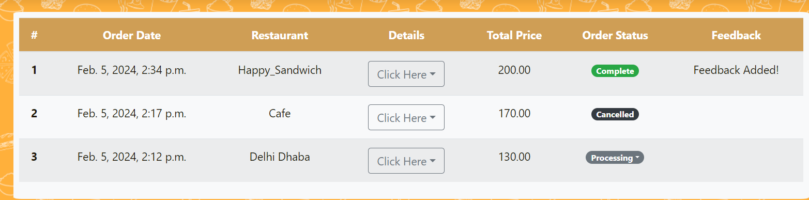
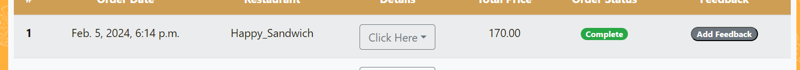

# hungry-Student

Tired of wasting your precious break-time in endless cafeteria lines?
Hungry for the perfect meal, but stuck searching through every menu on campus? Scrambling for a decent internet connection just to pay for your food? 
Say goodbye to lunch-time woes with Hungry Student!
Hungry Student is your campus food savior letting you:

* Browse menus- everything, everywhere, all at once!
* Order ahead and skip the line.
* Dine-in, takeaway or get it delivered(where available).

**Hungry Student**
*cos we're always hungry!*

## A Quick Guide - Index

| Type of User |  |
| :-----------: | :-----------:|
| Admin | Ideally an official of the institute where Hungry Student is implemented. |
| Restaurant | Restaurant manager/ someone authorised from the restaurant who function within and around the institute. |
| Customer | The students and faculty of the institute.  |
| Admin | [Click Here](#admins)|
| Restaurant | [Click Here](#restaurants) |
| Customer | [Click Here](#customers) |

### About the Team

- Jyosna Philip (23122019): Handled Restaurant Module, Partial Worked with the User Module.
- [GitHub]: https://github.com/jyosnaphilip.

- Fathimathul Susna ShoukkathAli (23122014): Handled Custom Module, Partial Worked with the User Module.
- [GitHub]: https://github.com/FathimathulSusnaAli.

### Guide for admins  { # admins}

- The admin has to login at http://127.0.0.1:8000/login.

- Once logged in,admin is shown the dashboard where various analysis of the site is provided.

- You will be notified of new users who signed up. It is shown in the envelope symbol on the topbar.

- Clicking on 'Users' will retreive all the users of the site, showing the type of users. Their status can be toggled.

- Clicking on 'Restaurants' on the sidebar will retrieve all the restaurants available in the site. 

- New restaurants can be added by clicking on the 'Create Restaurant' option.

- Clicking on 'Account' option in the sidebar will load all the customers who have signed up on the site. They can be created,edited and activated/deactivated.

- Clicking on 'Feedback' in the sidebar will load all the feedbacks given on all the restaurants of the site.

- Clicking on 'Orders' in the sidebar will load all the orders generated in the site.

Admin can change the Order Status of an order by clicking on 'Edit Order Status' option available next to each order, if the need arises.

The admin can click on the icon next to admin name on upper right corner to edit profile or logout.

### Guide for Restaurants

- Restaurants have to be added by the site admin. Hence restaurants who intend to be Hungri-fied should first contact the site admin at info@hungry-student.com or
contact@hungry-student.com.

- Once you get your username and login from the site admin, you can head directly to http://127.0.0.1:8000/login.

- You are then redirected to your dashboard where we will give a detailed analysis of your orders.

- click on the icon on the upper right corner with your name next to it. A drop down containing options for logging out and editing your profile will be available.

- clicking on the profile option will lead you to the page alowing you to edit or view your profile

- Click on Add today's order option on the sidebar. This will render you a page to add new items into your menu as well as check the current items in it.

 
Options next to each food item allows you to edit, toggle the active status of a food item or delete it from your menu.

You can click on the inactive button again to reactivate the item.

- Clicking on the 'Today's orders give you the history of all orders recieved by you.

When an order is processing, you have an option to accept or decline the order. However once either of the action is done, no reversal is possible. If the customer cancels from their side, it will be updated.

The 'Click Here' option next to each order shows the items and the quantity.

You will be notified of new orders.

The number of orders that have been accepted but not completed are shown on your dashboard.

- Clicking on the 'Feedback' option of your sidebar, you can view the feedbacks given by customers.

- Click on 'View details' of each feedback, provides you with the items ordered in that order, which may help you in improving your services.

### Guide for Customers

- Going to http://127.0.0.1:8000 will take you to the homepage of Hungry Student.

- Click on Sign up to signup, if you are already a user, you can directly click on the 'Order now' button.
- You will now be redirected to the login page.

- Click on 'Create account' to register and fill in your details in the page that gets rendered.
 

- Once you are signed in, you will see the homepage for users who have signed in.

- You will be able to see all the restaurants available to you.

Clicking on the specific restaurant will show you a detailed view of each restaurant.

Here you can also see the different items available at each restaurant.

- Clicking on Profile in the above topbar shows you your profile and has options to edit it.

To order, you can always click on 'Order Now' in the topbar. 

This redirects you to the following page.

- The dashboard option on the sidebar will lead to a page that contains personalised analysis on user activity.

- Past orders option on sidebar shows the orders.

- As long as the order is processing,i.e., neither accepted nor declined by the restaurant, the customer has an option to cancel their order.

- Once an order is completed an option is given to add feedback.

- Once the feedback is added, it can be viewed in the 'given feedbacks' option in the sidebar, where details regarding the order can also be viewed.

- Users can logout by clicking the icon on the top right corner.