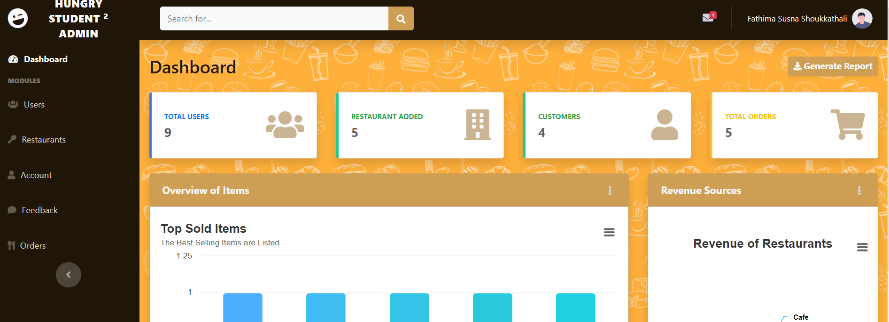
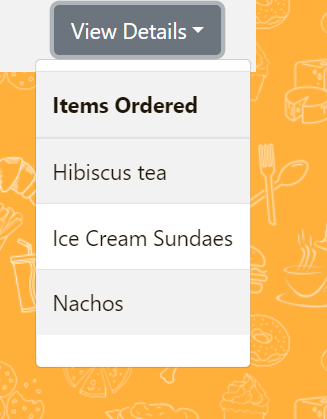

# hungry-Student

Tired of wasting your precious break-time in endless cafeteria lines?
Hungry for the perfect meal, but stuck searching through every menu on campus? Scrambling for a decent internet connection just to pay for your food? 
Say goodbye to lunch-time woes with Hungry Student!
Hungry Student is your campus food savior letting you:

* Browse menus- everything, everywhere, all at once!
* Order ahead and skip the line.
* Dine-in, takeaway or get it delivered(where available).

**Hungry Student**
*cos we're always hungry!*

## A Quick Guide - Index

| Type of User |  |
| :-----------: | :-----------:|
| Admin | [Click Here](#admins)|
| Restaurant | [Click Here](#restaurants) |
| Customer | [Click Here](#customers) |

### Guide for admins  { # admins}
- The admin has to login at http://127.0.0.1:8000/login.

- Once logged in, admin is shown the dashboard where various analysis of the site is provided.

- You will be notified of new users who signed up. It is shown in the envelope symbol on the topbar.

- Clicking on 'Users' will retreive all the users of the site, showing the type of users. Their status can be toggled.

- Clicking on 'Restaurants' on the sidebar will retrieve all the restaurants available in the site. 

- New restaurants can be added by clicking on the 'Create Restaurant' option.

### Guide for Restaurants

- Restaurants have to be added by the site admin. Hence restaurants who intend to be Hungri-fied should first contact the site admin at info@hungry-student.com or
contact@hungry-student.com.

- Once you get your username and login from the site admin, you can head directly to http://127.0.0.1:8000/login.

- You are then redirected to your dashboard where we will give a detailed analysis of your orders.

- click on the icon on the upper right corner with your name next to it. A drop down containing options for logging out and editing your profile will be available.

-clicking on the profile option will lead you to the page alowing you to edit or view your profile

- Click on Add today's order option on the sidebar. This will render you a page to add new items into your menu as well as check the current items in it.

 
Options next to each food item allows you to edit, toggle the active status of a food item or delete it from your menu.

You can click on the inactive button again to reactivate the item.
-Clicking on the 'Today's orders give you the history of all orders recieved by you.

When an order is processing, you have an option to accept or decline the order. However once either of the action is done, no reversal is possible. If the customer cancels from their side, it will be updated.

The 'Click Here' option next to each order shows the items and the quantity.

You will be notified of new orders.

The number of orders that have been accepted but not completed are shown on your dashboard.

-Clicking on the 'Feedback' option of your sidebar, you can view the feedbacks given by customers.

-Click on 'View details' of each feedback, provides you with the items ordered in that order, which may help you in improving your services.

### Guide for Customers
